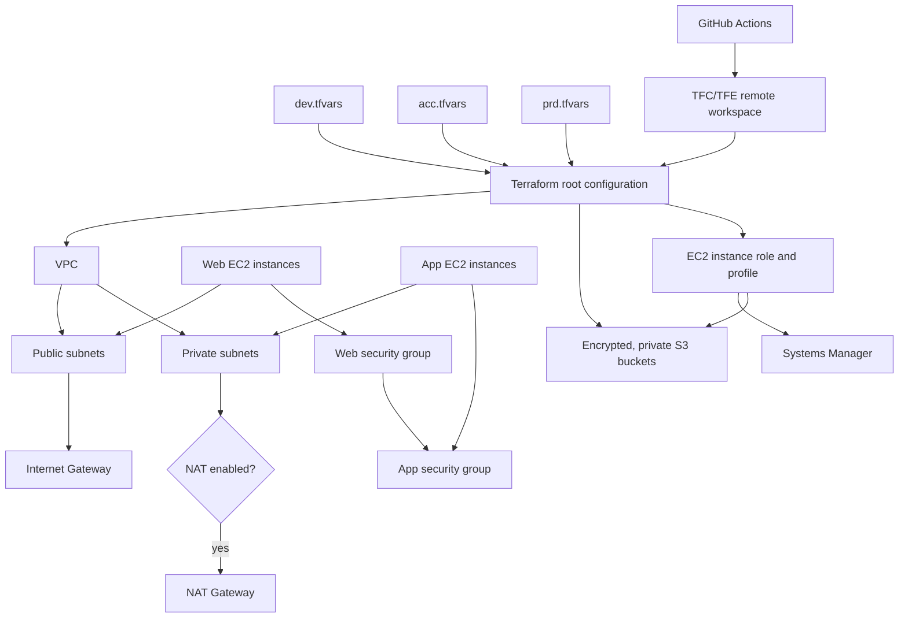

# AWS application hosting stack with Terraform

This repository is a reusable Terraform root configuration for a small application-hosting stack on AWS. It creates a VPC, public and private subnets, routing, security groups, EC2 instances, an EC2 IAM instance profile, and encrypted S3 buckets. The same root configuration is used for `dev`, `acc`, and `prd`; each environment supplies its own `.tfvars` file.

Terraform state is stored in Terraform Cloud or Terraform Enterprise (TFC/TFE) through the `remote` backend. GitHub Actions runs plans for every push and pull request, then applies environments sequentially only after a push to `main` or an explicit workflow dispatch.

## What it creates

- A VPC with DNS support enabled.
- Public subnets with an internet gateway and public route table.
- Private subnets with an optional single NAT Gateway and private route table.
- A web security group with configurable CIDR-based ingress rules.
- An app security group that accepts `app_port` from the web security group, plus optional CIDR rules.
- EC2 instances created from the `ec2_instances` map. `role = "web"` places an instance in a public subnet; `role = "app"` places it in a private subnet.
- An EC2 IAM role and instance profile with Systems Manager access. If S3 buckets are configured, the role also receives object and bucket-list permissions for those buckets.
- Optional RSA SSH key-pair generation. The generated private key is stored in Terraform state; see [Key-pair handling](#key-pair-handling).
- S3 buckets with AES-256 server-side encryption and public-access blocking. Versioning is enabled per bucket.

The template does not install an operating system application, create a load balancer, create a database, or configure DNS. AMIs, application deployment, patching, and monitoring remain outside this root configuration.

## Architecture



## Repository layout

```text
.
├── main.tf                       # Network, security, IAM, EC2, and S3 resources
├── variables.tf                  # Typed and validated input contract
├── output.tf                     # IDs, addresses, bucket names, and profile name
├── provider.tf                   # AWS region and default tags
├── backend.tf                    # Partial TFC/TFE remote backend
├── versions.tf                   # Terraform and provider constraints
├── envs/<env>/<env>.tfvars       # Environment infrastructure values
├── envs/<env>/<env>.tfconfig     # TFC/TFE hostname, organization, and workspace
└── .github/workflows/            # Plan and sequential apply workflows
```

## Required authentication and secrets

There are two separate authentication paths. Do not put AWS access keys in GitHub Actions unless you intentionally choose a GitHub-to-AWS deployment design; this workflow delegates Terraform execution to TFC/TFE.

| Credential | Where it goes | Required for | Purpose |
|---|---|---|---|
| `TF_TOKEN` | GitHub repository secret: **Settings > Secrets and variables > Actions** | GitHub Actions | Lets the runner authenticate to TFC/TFE and trigger remote runs. |
| TFC/TFE user or team token | Local Terraform CLI credential store via `terraform login` | Local runs | Lets the local CLI initialize the remote backend and trigger plans/applies. |
| AWS credentials or dynamic provider credentials | TFC/TFE workspace or variable set | Remote plan/apply | Lets the TFC/TFE worker call AWS. Prefer short-lived dynamic credentials/OIDC. |

For static AWS credentials in TFC/TFE, configure these as **sensitive environment variables**, never in `.tfvars` or committed files:

```text
AWS_ACCESS_KEY_ID
AWS_SECRET_ACCESS_KEY
AWS_SESSION_TOKEN       # only for temporary credentials
```

`AWS_DEFAULT_REGION` is optional because the AWS provider uses `aws_region` from the selected `.tfvars` file. Set it as a workspace environment variable if other AWS tooling in the workspace needs it.

### Assume-role clarification

The repository does not define an AWS provider `assume_role` block. The `sts:AssumeRole` policy in `main.tf` is an EC2 service trust policy: it allows EC2 to assume the instance role after launch. It is not the role used by Terraform to deploy the stack.

For deployment through a role, configure TFC/TFE dynamic provider credentials/OIDC and grant the TFC/TFE identity permission to assume the target AWS role. Alternatively, provide an AWS credential chain supported by the TFC/TFE worker. The target role needs permissions for the resources in this repository, including VPC, EC2, IAM, S3, and Systems Manager operations.

## TFC/TFE setup

1. Create one workspace per environment, for example `myapp-dev`, `myapp-acc`, and `myapp-prd`.
2. Set each workspace to **Remote** execution.
3. Replace `your-tfe-org` in each `envs/<env>/<env>.tfconfig` with the real organization name. Change `hostname` when using Terraform Enterprise.
4. Configure AWS credentials or dynamic provider credentials in each workspace/variable set.
5. Add `TF_TOKEN` to the GitHub repository secret store.
6. Ensure the workspace policy permits the Terraform identity to create and manage the resources listed above.

The workspace names and backend config are intentionally separate from the infrastructure values. To reuse this template, copy an environment directory, change its workspace name and `.tfvars`, then add that environment to `ENVIRONMENTS` in `.github/workflows/terraform.yml`.

## Local workflow

Prerequisites: Terraform `>= 1.5.0`, AWS permissions available to the selected TFC/TFE workspace, and access to the configured organization.

```bash
terraform login

ENV=dev
terraform init \
  -reconfigure \
  -backend-config="envs/${ENV}/${ENV}.tfconfig"

terraform fmt -check -recursive
terraform validate
terraform plan \
  -var-file="envs/${ENV}/${ENV}.tfvars"

# Apply only after reviewing the plan.
terraform apply \
  -var-file="envs/${ENV}/${ENV}.tfvars"
```

Use `terraform init -reconfigure` when switching between environment backends. Do not run different environments concurrently from the same working directory; each initialization changes the selected remote workspace.

## GitHub Actions workflow

- `terraform.yml` builds a matrix from the `ENVIRONMENTS` list, formats and validates the configuration, and creates a remote plan for each environment on pushes and pull requests.
- The reusable deploy workflow applies environments in the order supplied by the matrix, only on `main` or a manually requested apply.
- Pull requests from forks cannot access repository secrets, so their remote plan jobs will not authenticate unless the workflow is adapted for that trust model.

## Key-pair handling

With `create_key_pair = true`, Terraform generates an RSA private key and stores it in Terraform state. Because remote state may contain the private key, protect the TFC/TFE workspace and state access accordingly. For production, consider managing the EC2 key pair outside Terraform and set:

```hcl
create_key_pair = false
key_name        = "an-existing-ec2-key-pair"
```

SSM access is enabled on every instance, so SSH is optional for normal administration.

## Important cost and deletion notes

- NAT Gateways and public IPv4 addresses incur AWS charges. `enable_nat_gateway` is disabled in the example `dev` environment and enabled in `acc` and `prd`.
- `force_destroy = true` allows Terraform to delete non-empty S3 buckets. Keep it `false` for important data.
- A single NAT Gateway is created in the first public subnet when enabled. This keeps the template simple but is not a multi-AZ NAT design.
- The default EC2 AMI lookup selects the most recent Amazon Linux 2023 x86_64 AMI in the configured region. Set `ami_id` to pin a known image.

## Reuse checklist

1. Copy `envs/dev` to a new environment directory.
2. Set a unique `environment`, CIDR ranges, AWS region, tags, and TFC/TFE workspace name.
3. Define public/private subnet keys that match each EC2 instance's `subnet_key`.
4. Keep web ingress narrow, especially SSH; prefer SSM instead of opening port 22.
5. Set S3 `purpose`, `enable_versioning`, and an intentional `force_destroy` value.
6. Add the environment to the workflow matrix and run a plan before applying.
